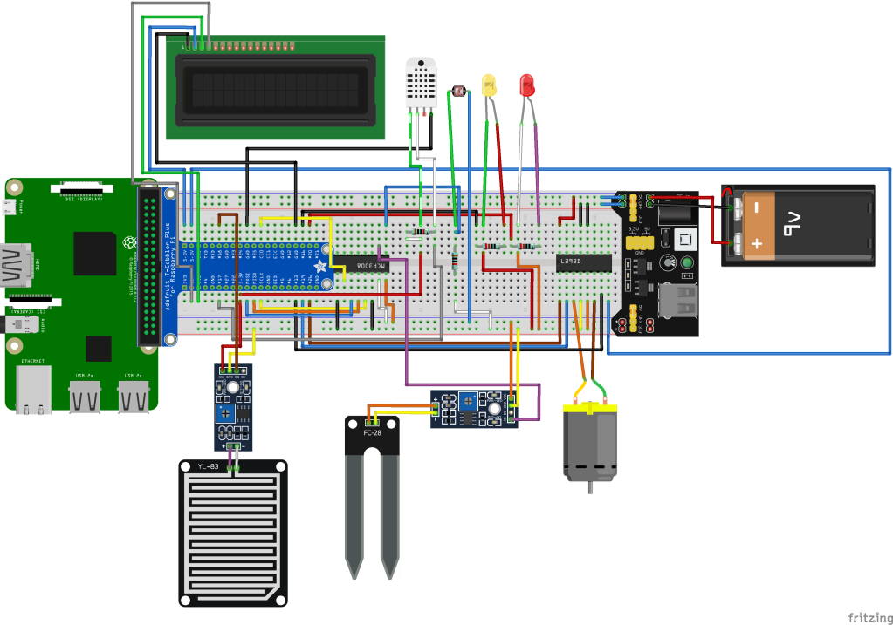

# Smart Irrigation System

This repository is part of the final project of Advanced diploma studies in Software development.
During 5 five weeks, I came up with a project solution using embedeed systems, python and sensors. 

Full projects' information is available via https://siscristhiancanon.wordpress.com/. It includes weekly updates of the project sharing videos of sensor's operation, components used, circuit diagrams.

The project was selected to be part of  national science fair in Malta. 

## Overview
The Smart Irrigation System is a project solution that aims to facilitate small farmers to water the plants automatically based on the moisture of soil, ambient temperature, rain probability, and using a photoresistor for water plants during the night and therefore saving water resources by showing every sensor percentage in LCD. This project will improve farmers’ work time used to this labour.

### Circuit diagram 

 
### Videos :video_camera:
:battery: [5V DC Motor](https://youtu.be/QEIF5RqSYGQ) 
:cactus: [Soil Moisture](https://youtu.be/ukuF3xT2OrU) 
:checkered_flag:[Final Project Testing](https://youtu.be/HzY8GzEWSyE)
